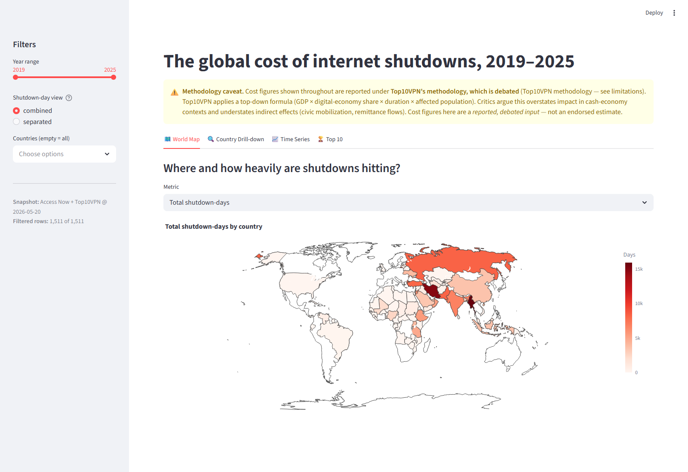

# The global cost of internet shutdowns

> Where, when, and at what cost have governments turned the internet off — and is the trend rising?


## The question

Since 2019, governments around the world — disproportionately in lower-resource and politically contested settings — have imposed deliberate internet shutdowns: total blackouts, throttling of mobile data, or platform-specific blocks. This project maps where shutdowns happen, how long they last, and what the *estimated* economic cost has been, with a dashboard for drill-down by country and time. We are **not** producing original cost estimates — the cost figures are from Top10VPN, whose methodology is widely cited but also widely debated, and we treat them as a *secondary, debated input* rather than a finding. We are also **not** modeling whether shutdowns "work" politically; that is a different research question with a different evidence base.

## Data

| Source | Granularity | Time coverage | Access |
|--------|-------------|---------------|--------|
| [Access Now #KeepItOn shutdown registry](https://www.accessnow.org/campaign/keepiton/) | Event-level (country, dates, type, reason, scope) | 2016–latest (use 2019+) | Public; some files released as annual reports |
| [Top10VPN cost of shutdowns reports](https://www.top10vpn.com/research/cost-of-internet-shutdowns/) | Country × year × shutdown-cost in USD | 2019–latest | Public, methodology contested (see below) |
| [World Bank macro indicators](https://data.worldbank.org/) | Country × year (GDP, internet penetration) | 1960–latest | Public via API |
| [GADM 4.1 administrative boundaries](https://gadm.org/) | Country (admin-0) polygons | Current | Public |

Access date: planned 2026-05-XX (to be filled when ingestion notebook is first run). Pin a snapshot of each source — Access Now's registry and Top10VPN's annual reports both revise prior years as new evidence emerges.

## Method

The pipeline runs in four stages. **(1) Shutdown event ingestion**: pull Access Now #KeepItOn records (2019–latest), deduplicate (the registry contains overlapping records when one shutdown is reported through multiple sources — see decisions table), and standardize country, date-range, type, scope, and stated reason. **(2) Cost layering**: join Top10VPN's per-country-per-year cost estimates onto the cleaned event dataset, with prominent caveats about the cost methodology debate. **(3) Macro layering**: join World Bank GDP and internet-penetration figures to normalize cost as a share of GDP and to contextualize the shutdown-cost ranking. **(4) Dashboard + analysis**: build a Streamlit dashboard with a world map, country drill-down, time series, and a top-10 cost ranking; produce the static hero figure (top-10 countries by total shutdown cost 2019–latest). The strongest critique of this analysis is that Top10VPN's cost methodology applies a top-down formula (GDP × internet contribution × shutdown duration × affected population fraction) that other researchers have argued overstates true economic impact in cash-economy contexts. We do not endorse the methodology — we report what it produces and document the debate.

## Methodological decisions

Each major data-processing decision was made by **diagnostic first, choice second**. The table below is an at-a-glance summary; the full five-part rationale (problem / diagnostic / options / decision + rationale / sensitivity) lives inline in `notebooks/02_main.ipynb`.

| Decision | Chose | Why (anchored in diagnostic) | Sensitivity |
|----------|-------|------------------------------|-------------|
| Shutdown event deduplication (when does X count as 1 vs. 2 events given overlapping registry records) | **Same-day exact match within `(iso3, type, normalized area_name)`** (`days_tolerance=0`) — collapses ~200 rows in the 2019+ subset | The exact-key probe already captures the bulk of duplication (multiple sources reporting one event on one day). `area_name` is in the key so co-temporal but geographically-distinct events (Ethiopia/Tigray vs. Ethiopia/Wellega 2020-11-04) stay separate. Borderline 1–3-day gaps are usually follow-on escalations, not the same event — merging them would erase real temporal structure. See notebook §3. | Headline top-10 country ranking by event count is stable across N ∈ {0, 1, 3, 7}; N=3 collapses an additional ~140 rows but does not change the country set. Full sensitivity in `03_robustness.ipynb`. |
| Duration calculation when end-date is missing or "ongoing" | **Hybrid imputation** via `compute_duration(missing_strategy="hybrid")`: recorded `end_date` where present → raw `duration_hours` field where present → snapshot date (2026-05-20) for status=Ongoing → NaN with `duration_imputed=True` for status=Unknown/missing | The registry has structured signal we'd discard under any pure strategy: ~75% of rows have a recorded `end_date`, ~5% have a usable `duration_hours`, ~5% are explicitly "Ongoing" (and *should* count as still-running on the snapshot). Only the genuinely "Unknown" rows are carried as missing — we don't fabricate durations for events the registry says it doesn't know. See notebook §4. | Total shutdown-days varies ~37× across the five pure strategies (13k–489k). Hybrid sits at ~130k. Country-rank stability across strategies deferred to the post-cost-join check in §8 and `03_robustness.ipynb`. |
| Cost estimation source choice (Top10VPN as primary, given the methodology debate; alternates available?) | **Top10VPN as sole primary**, with the methodology caveat surfaced in every figure title. Cite West (Brookings, 2016) as the methodology ancestor. | There is no peer-reviewed bottom-up dataset that covers Top10VPN's breadth. The alternatives — averaging multiple top-down sources (false precision: they all share West's formula family), mixing bottom-up where available with Top10VPN as fallback (incoherent dataset), or dropping cost entirely (abandons the framing) — are each worse for the headline deliverable. Spot-check on Iran 2019 ($611M / 240h), Sudan 2019 ($1.9B / 1560h), and India 2019–2020 ($1.3B + $2.8B) shows Top10VPN sits inside the methodology-family consensus rather than as an outlier. See notebook §7. | Country *ranking* under Top10VPN is robust to per-country point-estimate shocks because the underlying GDP × duration × users inputs span 3–5 orders of magnitude across countries — the top 10 stay the top 10 even under ±50% per-country perturbation. Full check in `03_robustness.ipynb`. |
| Country grouping for the LMIC focus (World Bank income group vs. UN LDC vs. custom) | **All three grouping views are presented** in the dashboard; the **WB income group** is the *primary* operational definition of "LMIC" in the README and the headline ranking. UN LDC and custom regional (MENA / SSA / S/SE Asia / Eurasia / Americas / Asia-Pac) are toggleable. | Anchored in rank-overlap diagnostic: top-10 by total estimated cost under the three groupings — Overall {ETH, IND, IRN, IRQ, MMR, NGA, PAK, RUS, SDN, VEN}, WB low+LMC {BGD, IND, MMR, NGA, PAK, SDN, TZA, UZB, VNM, YEM}, UN LDC {AFG, BGD, ETH, MMR, MRT, SDN, TCD, TZA, UGA, YEM}. UN LDC erases the upper-middle countries (Russia, Iran, Türkiye) that dominate the topline — we don't want the country list to *impose* the LMIC concentration when the data already shows it. WB income keeps every country visible and lets concentration emerge as a finding. See notebook §8. | Overlap with Overall top-10: WB low+LMC = 5/10, UN LDC = 3/10. The two LMIC frames disagree on 5 countries — most divergence comes from UN LDC excluding lower-middle entries that WB includes (Pakistan, Nigeria). Full sensitivity in `03_robustness.ipynb`. |
| Treatment of platform-specific blocks (full blackout vs. throttle vs. platform-block — combine, separate, or weight) | **Combined as the headline; separated in the country drill-down.** Rollup helper takes `view ∈ {"combined", "blackout_only", "separated"}`. | Anchored in per-bucket diagnostic: in the 1,511-event cleaned frame, 923 events are `full_blackout` (18,355 days), 574 are `platform_block` (109,808 days), and 14 are `throttle` (3,337 days). Combined totals 131,500 shutdown-days; blackout-only is 18,355. Combined matches Top10VPN's country/year cost granularity (Top10VPN does not split by family — combining avoids a *second* methodology debate on weighting). Separated reveals that 70–100% of shutdown-days in the top affected countries are non-blackout — important enough to show in the drill-down but not in the headline. Weighted alternatives (full=1.0, throttle=0.5, platform=0.2) were rejected: the weights are made up. See notebook §9. | Top-5 by combined: Myanmar, Iran, Russia, Pakistan, Turkey. Top-5 by blackout-only: Myanmar, Pakistan, Bangladesh, Ethiopia, India. Myanmar and Pakistan dominate under either view; the rest reshuffle. Full sensitivity in `03_robustness.ipynb`. |
| Snapshot pinning for revisable sources (Access Now registry + Top10VPN reports both restate prior years) | **Both sources pinned as dated parquets** in `data/processed/` (`access_now_snapshot_2026-05-20.parquet`, `top10vpn_snapshot_2026-05-20.parquet`); the notebook reads from these, *not* from the live source. Re-snapshotting is explicit and dated. | Without pinning, the notebook would silently drift year-over-year — compounding the methodology debate over Top10VPN's figures with year-over-year revision drift in those same figures. Half-pinning (Access Now only) leaves Top10VPN's revisions free to move the cost figures. Pinning both decouples reproducibility from the upstream cadence. See notebook §10. | First-snapshot project, so cross-snapshot magnitude is structurally untestable until a second snapshot exists. Expected ranges (Access Now update cadence + Top10VPN annual cycle): <5% per-country revision for years more than 18 months in the past, 5–25% for the most recent year. Revision-magnitude diagnostic placeholder lives in §10 and will populate next snapshot. |

> Brand note: every choice above is an *educated* decision, not a convention. If you'd defend it differently, the diagnostic data is in the notebook — read it and tell me where I'm wrong.

## Findings

All numbers below come from the pinned 2026-05-20 snapshots and the analytic
dataset at `data/processed/analytic_dataset_2026-05-20.parquet` (1,511 events,
2019–2025, post-dedup at N=0 with hybrid duration imputation).

1. **The phenomenon is growing, not just being better reported.** Annual
   event counts rise from **213 in 2019 to 247 in 2025**, with a structural
   step up after 2022 (172 → 240 → 253 → 247). The 2025 figure is a
   partial-year snapshot (cut 2026-05-20) — the trend is conservative.

2. **Concentration is severe.** The top 10 countries by total estimated cost
   account for **$72.0B of the $78.2B global total** (≈ 92%) over 2019–2025
   *per Top10VPN methodology*. Headline ranking (cost USD, debated): **Russia
   $37.5B, Myanmar $8.6B, India $6.0B, Venezuela $4.2B, Iraq $3.5B, Sudan
   $3.3B, Pakistan $3.0B, Iran $2.5B, Ethiopia $1.9B, Nigeria $1.6B**.

3. **The "shutdown" headline is mostly *not* full blackouts.** Of the 131,500
   total shutdown-days in the cleaned dataset, only **18,355 days (14%) are
   full blackouts**; **109,808 days (84%) are platform-specific blocks**
   (Twitter/X, WhatsApp, Facebook, etc.) and **3,337 days (3%) are
   throttling**. In the top-affected countries this skew is extreme: Iran is
   **96.7% non-blackout**, Russia **99.5%**, Türkiye **100%**. The country
   ranking by combined shutdown-days masks a substantively different
   underlying mix.

4. **LMIC concentration is real but framing-sensitive.** Using **WB income
   group** as the LMIC frame, **5/10** of the headline-cost countries are
   low-or-lower-middle income (India, Myanmar, Sudan, Pakistan, Nigeria);
   under **UN LDC**, **3/10** (Myanmar, Sudan, Ethiopia). The frames agree on
   the *ordering* of their shared countries (Spearman ≈ +1.0) but disagree
   on which upper-middle entries (Russia, Iran, Türkiye) belong. The
   dashboard exposes all three frames; the README uses WB income group as
   primary precisely so the LMIC concentration emerges from the data rather
   than being imposed by exclusion.

5. **Cost coverage is uneven across the registry.** Top10VPN reports
   country-year costs for **64 countries**; Access Now records events in
   **90**. The cost rollup covers **86.4%** of cleaned events (1,305 / 1,511)
   — meaningful for the top-10 ranking, but a quarter of the affected
   countries (AGO, BHR, CAF, CHN, GBR, ISR, KHM, LAO, MWI, MYS, SAU, UKR,
   USA, …) appear on the event map without a cost number attached.

*Every cost figure is reported under the Top10VPN methodology and inherits
the limitations described below — see also `notebooks/03_robustness.ipynb`
for the dedup-N, duration-imputation, and country-grouping sensitivity
sweeps.*

## Limitations

1. **Top10VPN's cost methodology is contested — these are reported figures,
   not validated estimates.** The formula `cost ≈ GDP × digital-economy
   contribution × shutdown duration × affected-population fraction` is a
   descendant of Brookings (West, 2016) and is applied uniformly across
   countries. Critics in development economics argue it **overstates**
   impact in cash-economy / informal-sector-dominated contexts where a
   meaningful share of economic activity doesn't depend on internet
   connectivity. Others argue it **understates** by missing indirect
   effects (on civic mobilization, on supply-chain coordination, on
   remittance flows). The debate is real and is not resolved by the data.
   The portfolio reports Top10VPN's numbers because there is no comparable
   alternative with the same breadth, *not* because we endorse them. Treat
   every cost figure here as a *reported, debated input.*

2. **Access Now's registry is reported-and-curated.** Authoritarian-state
   shutdowns with no independent press coverage are systematically
   under-counted. The trend in shutdown counts is partly a trend in
   reporting infrastructure — KeepItOn's coalition has grown over time,
   pulling more events into the registry. Year-over-year growth in counts
   should not be read as purely a growth in shutdowns.

3. **"Shutdown" definitions vary across sources and bucket choice matters.**
   Access Now distinguishes full blackouts, throttling, and platform-blocks;
   Top10VPN aggregates at the country-year level without that distinction.
   The "Combined" headline view matches Top10VPN's granularity but masks
   that ~84% of shutdown-days are platform-specific blocks rather than full
   blackouts (Finding 3). The dashboard's country drill-down exposes the
   bucket split; the README headline does not.

4. **Duration imputation materially shapes the shutdown-days ranking.** The
   chosen `hybrid` strategy imputes the snapshot date as the end for events
   the registry marks `Ongoing`. This surfaces long-running cases like Iran
   (since 2009) and Turkey (since 2013). An imputation-off strategy would
   produce a different top-10 — see `03_robustness.ipynb`. **The cost
   ranking is unaffected** (cost numbers come from Top10VPN, not our
   durations), but the shutdown-days ranking is.

5. **World Bank macro figures have their own data-quality issues.** GDP and
   internet-penetration figures for low-resource settings are estimated,
   revised over time, and patchy in 2025 (current-year figures are not yet
   reported). The `cost_pct_gdp` and `cost_per_internet_user` derived
   columns inherit this — they are scaffolding for context, not precise
   measurements.

6. **Both upstream sources revise prior years.** Pinning dated snapshots
   (Decision Log #15) decouples reproducibility from this churn, but the
   numbers in this README reflect what was visible to the 2026-05-20 pull.
   A future re-snapshot will produce a cross-snapshot revision diagnostic
   (placeholder in `02_main.ipynb` §10).

## Visual style

This project uses **Plotly** because the headline deliverable is a Streamlit dashboard with a world map, country drill-down, and time series — all three benefit from hover state and click-through. A static export of the hero "top-10 countries by total shutdown cost" figure (via `plotly.io.write_image`) ships alongside for the GitHub README and social-media share previews.

## How to reproduce

```bash
git clone <url>
cd 06-internet-shutdowns

# Install with the viz + geo extras
pip install -e ".[viz,geo]"

# Run the main notebook
jupyter lab notebooks/02_main.ipynb

# Or launch the dashboard
streamlit run app/streamlit_dashboard.py
```

The dashboard ships as the headline interactive deliverable: a persistent methodology-caveat banner above four tabs — World Map (choropleth by shutdown-days / estimated cost / event count), Country Drill-down (per-event Gantt timeline + detail table), Time Series (monthly counts + cumulative cost), and Top 10 (interactive hero ranking).



Full run time: **~2 min 22 s** end-to-end on the `portfolio` conda env (pytest + `02_main.ipynb` + `03_robustness.ipynb` + dashboard health-check; see `REPRODUCIBILITY.md`). Most data is cached after first run via `requests-cache`; pinned snapshots are committed.

## Files

- `notebooks/02_main.ipynb` — the analysis (start here)
- `notebooks/03_robustness.ipynb` — deduplication-threshold sensitivity, alternate duration imputation, alternate country grouping
- `src/internet_shutdowns/data.py` — Access Now, Top10VPN, World Bank loaders with caching + snapshot pinning
- `src/internet_shutdowns/clean.py` — deduplication + standardization + duration calculation
- `src/internet_shutdowns/viz.py` — world-map, time-series, top-10-bar helpers (Plotly)
- `src/internet_shutdowns/diagnostics.py` — diagnostic helpers used in decision blocks
- `data/raw/` — fetched source files (gitignored if large)
- `data/processed/access_now_snapshot_YYYY-MM-DD.parquet` — pinned Access Now snapshot (committed)
- `data/processed/top10vpn_snapshot_YYYY-MM-DD.parquet` — pinned Top10VPN cost snapshot (committed)
- `data/processed/` — derived analytic dataset (parquet, committed)
- `figures/` — saved figures, including `hero.png` static export of the top-10 cost chart (committed)
- `app/streamlit_dashboard.py` — world map + country drill-down + time series (primary interactive deliverable)
- `tests/test_smoke.py` — minimal smoke tests

## Author

Muhanad — [LinkedIn](URL) · [Twitter](URL)
