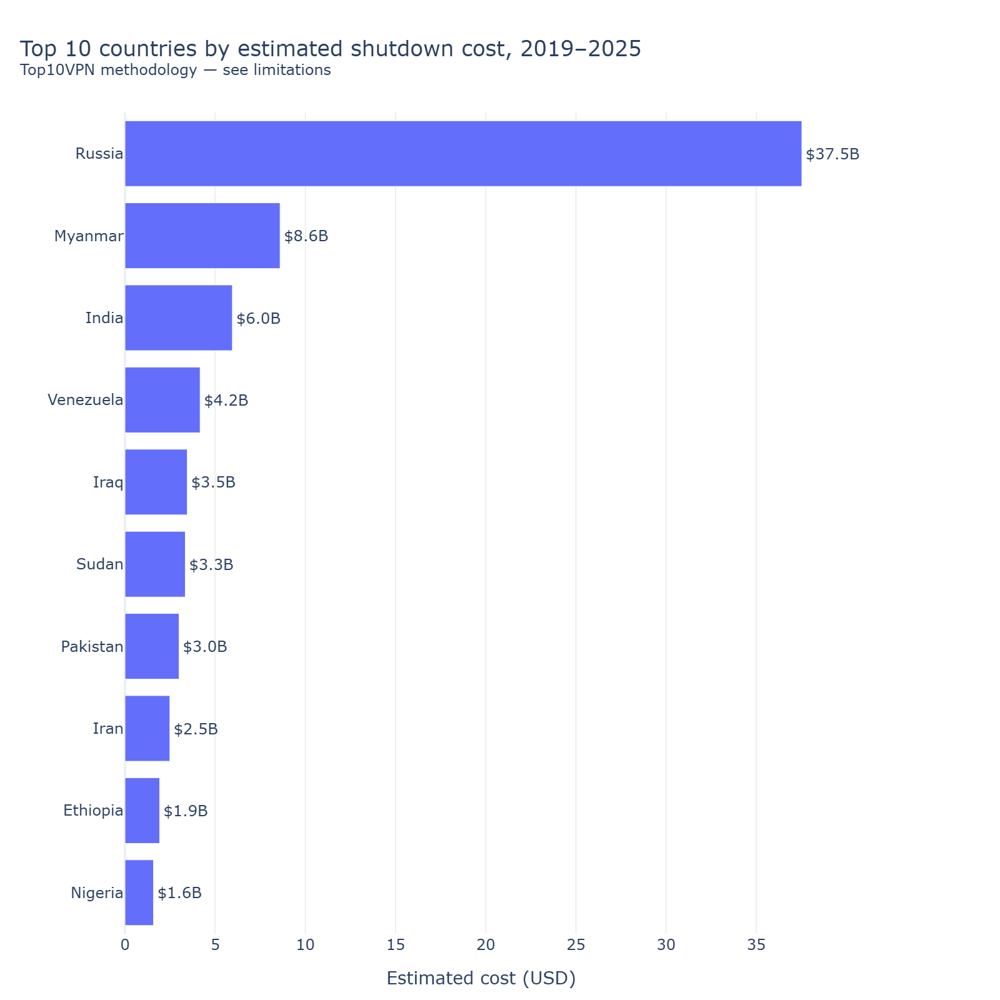

# The global cost of internet shutdowns

> Where, when, and at what cost have governments turned the internet off — and is the trend rising?



## The question

Since 2019, governments around the world — disproportionately in lower-resource and politically contested settings — have imposed deliberate internet shutdowns: total blackouts, throttling of mobile data, or platform-specific blocks. This project maps where shutdowns happen, how long they last, and what the *estimated* economic cost has been, with a dashboard for drill-down by country and time. We are **not** producing original cost estimates — the cost figures are from Top10VPN, whose methodology is widely cited but also widely debated, and we treat them as a *secondary, debated input* rather than a finding. We are also **not** modeling whether shutdowns "work" politically; that is a different research question with a different evidence base.

## Data

| Source | Granularity | Time coverage | Access |
|--------|-------------|---------------|--------|
| [Access Now #KeepItOn shutdown registry](https://www.accessnow.org/campaign/keepiton/) | Event-level (country, dates, type, reason, scope) | 2016–latest (use 2019+) | Public; some files released as annual reports |
| [Top10VPN cost of shutdowns reports](https://www.top10vpn.com/research/cost-of-internet-shutdowns/) | Country × year × shutdown-cost in USD | 2019–latest | Public, methodology contested (see below) |
| [World Bank macro indicators](https://data.worldbank.org/) | Country × year (GDP, internet penetration) | 1960–latest | Public via API |
| [GADM 4.1 administrative boundaries](https://gadm.org/) | Country (admin-0) polygons | Current | Public |

Access date: planned 2026-05-XX (to be filled when ingestion notebook is first run). Pin a snapshot of each source — Access Now's registry and Top10VPN's annual reports both revise prior years as new evidence emerges.

## Method

The pipeline runs in four stages. **(1) Shutdown event ingestion**: pull Access Now #KeepItOn records (2019–latest), deduplicate (the registry contains overlapping records when one shutdown is reported through multiple sources — see decisions table), and standardize country, date-range, type, scope, and stated reason. **(2) Cost layering**: join Top10VPN's per-country-per-year cost estimates onto the cleaned event dataset, with prominent caveats about the cost methodology debate. **(3) Macro layering**: join World Bank GDP and internet-penetration figures to normalize cost as a share of GDP and to contextualize the shutdown-cost ranking. **(4) Dashboard + analysis**: build a Streamlit dashboard with a world map, country drill-down, time series, and a top-10 cost ranking; produce the static hero figure (top-10 countries by total shutdown cost 2019–latest). The strongest critique of this analysis is that Top10VPN's cost methodology applies a top-down formula (GDP × internet contribution × shutdown duration × affected population fraction) that other researchers have argued overstates true economic impact in cash-economy contexts. We do not endorse the methodology — we report what it produces and document the debate.

## Methodological decisions

Each major data-processing decision was made by **diagnostic first, choice second**. The table below is an at-a-glance summary; the full five-part rationale (problem / diagnostic / options / decision + rationale / sensitivity) lives inline in `notebooks/02_main.ipynb`.

| Decision | Chose | Why (anchored in diagnostic) | Sensitivity |
|----------|-------|------------------------------|-------------|
| Shutdown event deduplication (when does X count as 1 vs. 2 events given overlapping registry records) | *to be filled during implementation* | *anchored in diagnostic — see notebook §3* | *to be filled* |
| Duration calculation when end-date is missing or "ongoing" | *to be filled during implementation* | *anchored in diagnostic — see notebook §4* | *to be filled* |
| Cost estimation source choice (Top10VPN as primary, given the methodology debate; alternates available?) | *to be filled during implementation* | *anchored in diagnostic — see notebook §5* | *to be filled* |
| Country grouping for the LMIC focus (World Bank income group vs. UN LDC vs. custom) | *to be filled during implementation* | *anchored in diagnostic — see notebook §3* | *to be filled* |
| Treatment of platform-specific blocks (full blackout vs. throttle vs. platform-block — combine, separate, or weight) | *to be filled during implementation* | *anchored in diagnostic — see notebook §3* | *to be filled* |
| Snapshot pinning for revisable sources (Access Now registry + Top10VPN reports both restate prior years) | *to be filled during implementation* | *anchored in revision-magnitude diagnostic — see notebook §3* | *to be filled* |

> Brand note: every choice above is an *educated* decision, not a convention. If you'd defend it differently, the diagnostic data is in the notebook — read it and tell me where I'm wrong.

## Findings

*To be filled during implementation. Each finding will be a falsifiable statement anchored in a specific number from the analysis (e.g., "Country X imposed Y total shutdown-days 2019–latest, with estimated cost Z USD per Top10VPN methodology"). Cost figures are **reported, not endorsed** — every cost finding is tagged with the methodology caveat.*

## Limitations

*To be filled during implementation. Expected categories: **Top10VPN's cost methodology is contested** — the figures here are reported under that methodology, not validated independently; Access Now's registry depends on what gets reported, so authoritarian-state shutdowns with no press coverage are systematically under-counted; "shutdown" definitions vary across sources (full blackout vs. throttle vs. platform-block); World Bank macro figures have their own data-quality issues in low-resource settings; the trend in shutdown counts is partly a trend in reporting infrastructure, not only in events.*

## Visual style

This project uses **Plotly** because the headline deliverable is a Streamlit dashboard with a world map, country drill-down, and time series — all three benefit from hover state and click-through. A static export of the hero "top-10 countries by total shutdown cost" figure (via `plotly.io.write_image`) ships alongside for the GitHub README and social-media share previews.

## How to reproduce

```bash
git clone <url>
cd 06-internet-shutdowns

# Install with the viz + geo extras
pip install -e ".[viz,geo]"

# Run the main notebook
jupyter lab notebooks/02_main.ipynb

# Or launch the dashboard
streamlit run app/streamlit_dashboard.py
```

Full run time: ~X minutes (most data is cached after first run via `requests-cache`; pinned snapshots are committed).

## Files

- `notebooks/02_main.ipynb` — the analysis (start here)
- `notebooks/03_robustness.ipynb` — deduplication-threshold sensitivity, alternate duration imputation, alternate country grouping
- `src/internet_shutdowns/data.py` — Access Now, Top10VPN, World Bank loaders with caching + snapshot pinning
- `src/internet_shutdowns/clean.py` — deduplication + standardization + duration calculation
- `src/internet_shutdowns/viz.py` — world-map, time-series, top-10-bar helpers (Plotly)
- `src/internet_shutdowns/diagnostics.py` — diagnostic helpers used in decision blocks
- `data/raw/` — fetched source files (gitignored if large)
- `data/processed/access_now_snapshot_YYYY-MM-DD.parquet` — pinned Access Now snapshot (committed)
- `data/processed/top10vpn_snapshot_YYYY-MM-DD.parquet` — pinned Top10VPN cost snapshot (committed)
- `data/processed/` — derived analytic dataset (parquet, committed)
- `figures/` — saved figures, including `hero.png` static export of the top-10 cost chart (committed)
- `app/streamlit_dashboard.py` — world map + country drill-down + time series (primary interactive deliverable)
- `tests/test_smoke.py` — minimal smoke tests

## Author

Muhanad — [LinkedIn](URL) · [Twitter](URL)
