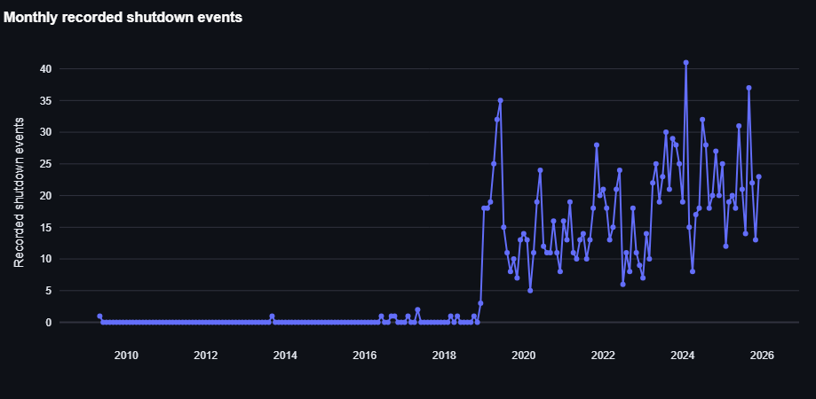
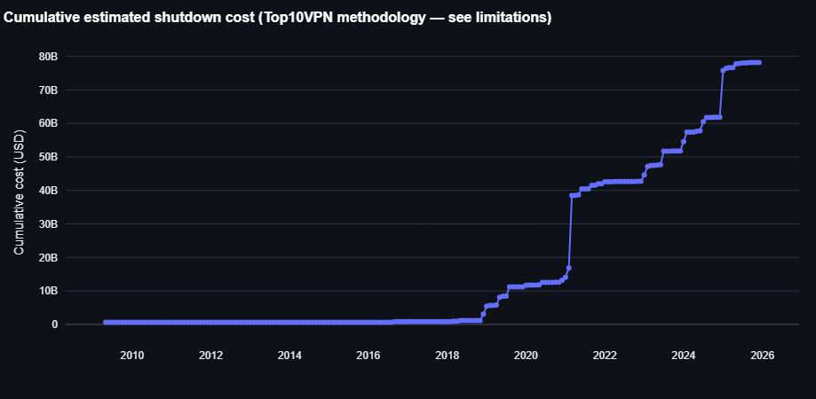
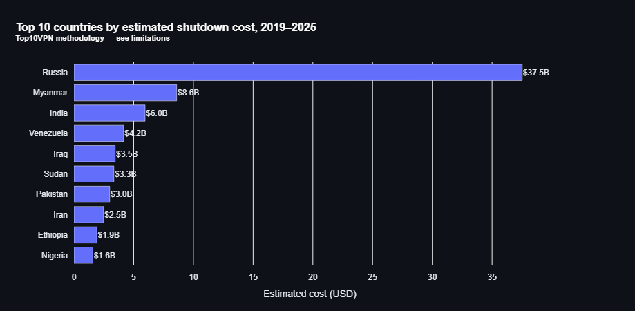
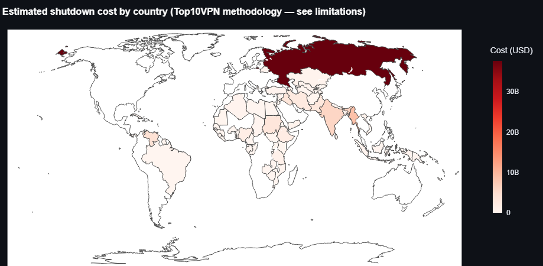
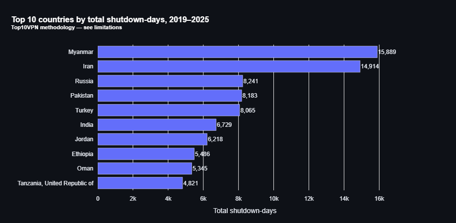
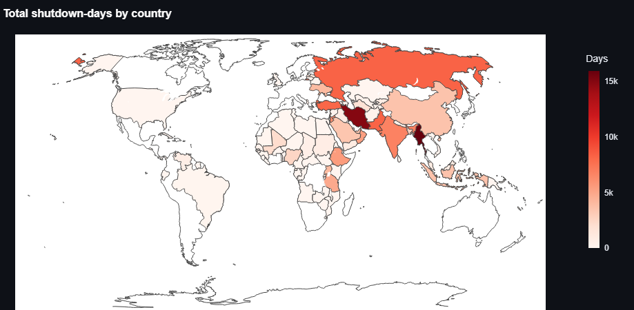
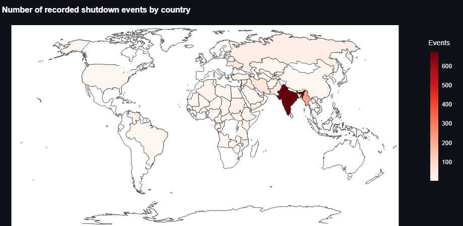
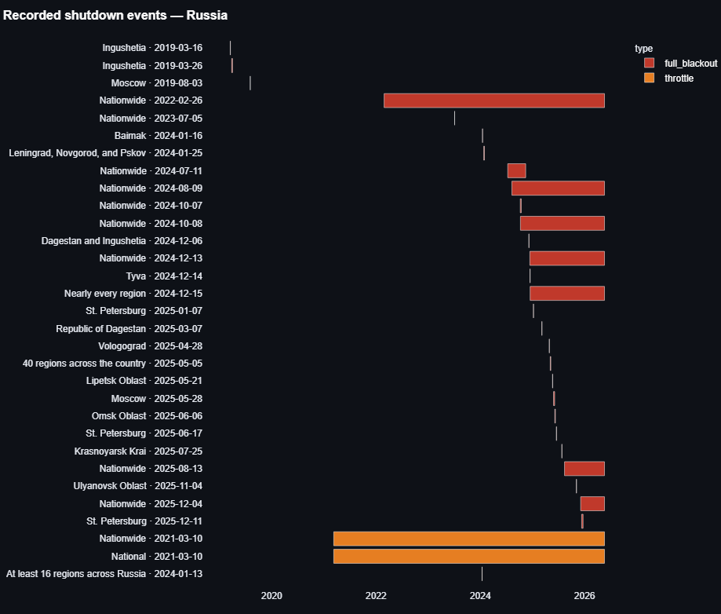

# The Global Cost of Internet Shutdowns

**A data-analytic report on where, when, and at what estimated cost governments turned the internet off, 2019–2025**

Author: Muhanad · Analysis stack: Python (pandas, Plotly, Streamlit) · Snapshot date: 2026-05-20

---

## Executive summary

On 4 November 2020, the #KeepItOn registry recorded seven separate entries for a single Ethiopian blackout in Tigray. Six of the seven described the exact same event, reported by six different newsrooms; the seventh was a geographically distinct shutdown in Western Oromia that happened to start the same day. That one cluster is the whole project in miniature. The hard part of measuring internet shutdowns is not finding dramatic numbers. It is deciding what counts as one event, how long a shutdown that never officially "ended" actually lasted, and whether a contested dollar figure belongs in the headline at all. Every number below rests on a documented answer to one of those questions.

The analysis pulls together four public sources (the Access Now #KeepItOn shutdown registry, Top10VPN's annual cost-of-shutdowns reports, World Bank macro indicators, and GADM administrative boundaries) into a single cleaned dataset of **1,511 deduplicated shutdown events spanning 2019 to 2025**, then ships it as an interactive Streamlit dashboard with a static hero figure for sharing. Four findings carry the report:

1. **The phenomenon is growing, not just better reported.** Annual recorded events rise from 213 in 2019 to 247 in 2025, with a structural step up after 2022.
2. **Cost is severely concentrated.** Ten countries account for roughly 92% of the global estimated total, but that total is a Top10VPN figure, and I treat it as a debated input, not a finding.
3. **The word "shutdown" is misleading.** Only 14% of measured shutdown-days are full blackouts; 84% are platform-specific blocks of services like X, WhatsApp, and Facebook.
4. **The cost ranking is robust to my processing choices; the shutdown-days ranking is not.** I demonstrate this with explicit sensitivity sweeps rather than asserting it.

What follows is less a story about which government is "worst" and more a worked example of how to build a defensible quantitative picture from sources that each carry a known bias. I will be explicit about where the data is strong, and equally explicit about where it is scaffolding.

---

## 1. The question and why it resists a clean answer

Since 2019, governments, disproportionately in lower-resource and politically contested settings, have deliberately cut connectivity: total blackouts, mobile-data throttling, or blocks targeting a single platform. The motivating question is simple to state and hard to answer well: *where do shutdowns happen, how long do they last, and what has the estimated economic cost been, and is the trend rising?*

Two boundaries define the project from the outset. I am **not** producing original cost estimates; the dollar figures come from Top10VPN, whose methodology is widely cited and widely debated, and I treat them as a secondary, contested input rather than a result I stand behind. I am also **not** modelling whether shutdowns "work" politically. That is a different research question with a different evidence base, and conflating it with cost measurement would muddy both.

The reason a clean answer resists this domain is that the two primary sources sit at different granularities and carry different biases. Access Now's registry is event-level and reported-and-curated: it knows about a shutdown only if someone documented it, which systematically under-counts authoritarian states with no independent press. Top10VPN's cost data is country-by-year and formula-driven, and it covers fewer countries but attaches a dollar figure. Joining them is where most of the analytical decisions live.

---

## 2. Data and method

| Source | Granularity | Coverage | Role |
|---|---|---|---|
| Access Now #KeepItOn registry | Event-level (country, dates, type, scope, reason) | 2019–2025 used | Primary event spine |
| Top10VPN cost reports | Country × year, USD | 2019–2025 | Cost layer (debated) |
| World Bank indicators | Country × year (GDP, internet %, population) | via API | Normalization context |
| GADM 4.1 boundaries | Country polygons | current | Choropleth geometry |

The pipeline runs in four stages. First, **event ingestion**: pull the registry, deduplicate overlapping records, and standardize country codes, date ranges, type, scope, and stated reason. Second, **cost layering**: join Top10VPN's per-country-per-year estimates onto the cleaned events. Third, **macro layering**: attach World Bank GDP and internet-penetration figures to express cost as a share of GDP and to contextualize the ranking. Fourth, **dashboard and analysis**: build the Streamlit surface (world map, country drill-down, time series, top-10 ranking) and export the static hero figure.

The strongest critique of the whole exercise is methodological, and it belongs up front. Top10VPN's cost formula is a top-down extrapolation, `cost ≈ GDP × digital-economy contribution × shutdown duration × affected-population fraction`, descended from Darrell M. West's 2016 Brookings work. Development economists argue it overstates impact in cash-economy contexts where much activity does not depend on connectivity; others argue it understates by missing indirect effects on civic mobilization, remittances, and supply chains. I do not endorse the formula. I report what it produces and surface the debate in every figure title, including the hero chart.

To keep the work reproducible against sources that silently revise prior years, both Access Now and Top10VPN are pinned as dated parquet snapshots (`*_snapshot_2026-05-20.parquet`) committed to the repository. The notebook reads from the pins, never the live source, so the same code re-run six months from now produces identical numbers unless I explicitly re-snapshot. Full end-to-end run time is about 2 minutes 22 seconds on the project conda environment.

---

## 3. The decisions that shape the numbers

A report that only presents results hides the most important analytical work. Each major data-processing step was made diagnostic-first: look at what the data actually does, then choose. Four decisions matter most.

### 3.1 What counts as one event?

Return to the Tigray cluster. Grouping the 2019+ data on `(country, start_date, type)` shows 1,182 singleton events and a long tail of clusters up to size seven; the exact-key collapse alone removes about 200 duplicate rows. The risk runs both ways: over-merging deflates per-country totals, under-merging inflates them. I chose **same-day exact matching within `(iso3, type, normalized area_name)`** (tolerance N=0), which collapses the 1,710 in-scope rows to **1,511 events**.

Keeping `area_name` in the key is what lets Ethiopia/Tigray and Ethiopia/Wellega stay separate despite sharing date and type. Why not merge events one to three days apart? Because a hand spot-check of those borderline cases (dozens of them in Indian districts like the Manipur sequence across late 2024) shows they are follow-on escalations dated to a new flare-up, not duplicate reports of one event. Merging them would erase the temporal structure the time-series view depends on. I confirmed this is not a load-bearing choice: the top-10 country set is identical across N ∈ {0, 1, 3, 7}.

### 3.2 How long did a shutdown last when nobody recorded an end?

About 24% of cleaned events carry no `end_date`. The reasons differ, and the registry tells us which is which: 211 are marked "Unknown," 81 are explicitly "Ongoing," 68 have no status, and six say "Ended" with a missing date from data-entry inconsistency. This distinction is decisive, because total shutdown-days swing roughly **37-fold** across naive strategies, from about 13,000 days if you drop every missing row to about 489,000 if you blanket-fill them all with the snapshot date.

I chose a **hybrid** rule: use the recorded end-date where present, fall back to a recorded duration field where present, impute the snapshot date only where the registry actively says the event is still "Ongoing," and carry the genuinely "Unknown" rows as missing with a flag. The principle is to use every signal the registry provides and fabricate nothing for events it admits it cannot date. Hybrid lands at about **131,500 total shutdown-days**, between the extremes, and honest about which rows are imputed.

### 3.3 Is Top10VPN defensible as the sole cost source?

I spot-checked Top10VPN's headline figures against the cases the literature has scrutinized most. For Iran's November 2019 protest blackout, Top10VPN reports $611M over 240 hours affecting 49M users; for Sudan's June 2019 post-coup shutdown, $1.9B over 1,560 hours; for India's 2019–2020 Kashmir and regional shutdowns, $1.3B then $2.8B. Each sits inside the order-of-magnitude consensus of the top-down methodology family. NetBlocks, CIPESA, and West's Brookings approach all land in the same low-billions range for these events, because they all share the same formula lineage.

That shared lineage is exactly why I rejected averaging multiple sources: it would manufacture false precision around one methodology rather than triangulate independent evidence. Mixing bottom-up academic estimates where available (such as ICRIER's lower India totals) with Top10VPN elsewhere would produce an incoherent ranking across mismatched methods. Dropping cost entirely would abandon the dollar framing that anchors public discourse on this topic. So I kept **Top10VPN as the sole primary**, with the caveat surfaced everywhere. The country ranking turns out to be robust to this anyway: the underlying inputs span three to five orders of magnitude across countries, so the top 10 survive even a ±50% per-country shock.

### 3.4 Which countries count as "LMIC"?

The LMIC concentration claim depends on how you define the group, so I present three framings and make the most transparent one primary. Under the **World Bank income group** definition (my primary frame), 5 of the 10 headline-cost countries are low or lower-middle income. Under the stricter **UN LDC** list, only 3 of 10 qualify, because LDC status excludes upper-middle countries like Russia, Iran, and Türkiye that dominate the topline. Within the countries any two frames share, the Spearman rank-correlation is essentially +1.0; the frames agree on ordering and disagree only on *who is in the room*.

I chose WB income group as primary precisely because it keeps every country visible and lets the LMIC concentration emerge from the data rather than being imposed by exclusion. The dashboard exposes all three as a toggle. What this does **not** mean: it does not mean shutdowns are an LMIC-only phenomenon. Russia tops the cost ranking and is high-income; the concentration is a tendency in the data, not a definitional boundary.

---

## 4. Findings

All figures below come from the pinned 2026-05-20 snapshots and the analytic dataset of 1,511 events.

### 4.1 The trend is rising

Annual recorded events climb from **213 in 2019 to 247 in 2025**, with a clear step up after 2022 (roughly 172 → 240 → 253 → 247 across 2022–2025). The 2025 figure is a partial-year snapshot cut on 2026-05-20, which makes the upward trend conservative rather than inflated. I read this carefully. Part of the rise reflects a genuine increase in shutdowns, and part reflects #KeepItOn's growing reporting coalition pulling more events into the registry over time. The growth is real, but it is not *purely* a growth in shutdowns; it is partly a growth in our ability to see them.

The monthly series makes the structure visible. The near-zero stretch before 2019 is not an absence of shutdowns but an artifact of the registry's coverage window and the project's `count_year ≥ 2019` scope; the handful of isolated pre-2019 spikes are long-running events (Iran since 2009, Türkiye since 2013) attributed to their start year. From mid-2019 the count steps up and stays elevated, with the densest cluster of high months falling in 2024–2025.

The same series, weighted by estimated dollars rather than event count, tells a complementary story: cost does not accrue smoothly.

The cumulative curve is dominated by two step-changes rather than steady growth — most visibly a near-vertical jump in early 2021 that reflects the large country-year cost figures (Myanmar's post-coup blackouts and Russia's escalating totals) entering the series. A reader should take the *shape* as the signal here: the topline is concentrated in a few high-cost country-years, which is exactly the concentration Finding 4.2 quantifies.

### 4.2 Estimated cost is severely concentrated

The top 10 countries by total estimated cost account for **$72.0B of the $78.2B global total, about 92%**, over 2019–2025, under Top10VPN methodology. The ranking is dominated by one outlier:

Russia alone carries $37.5B, nearly half the global total and more than four times the second-ranked country. Myanmar follows at $8.6B, then India ($6.0B), Venezuela ($4.2B), Iraq ($3.5B), Sudan ($3.3B), Pakistan ($3.0B), Iran ($2.5B), Ethiopia ($1.9B), and Nigeria ($1.6B). The caveat printed in the chart subtitle is not decoration. It is load-bearing, and it is baked into the title precisely so it travels with the figure — staying legible even when the chart is reused as a thumbnail or share preview, detached from this report's surrounding text.

By region, the concentration tilts toward Eurasia/Eastern Europe ($39.3B, almost entirely Russia) and South/Southeast Asia ($19.1B), followed by MENA ($10.1B), Sub-Saharan Africa ($5.1B), and the Americas ($4.3B). On the map, that single-country dominance is unmistakable: one landmass carries almost the entire upper end of the scale.

### 4.3 Most "shutdowns" are not blackouts

This is the finding most likely to be lost in a headline. Of the **131,500 total shutdown-days** in the cleaned dataset, only **18,355 (14%) are full blackouts**. The large majority, **109,808 days (84%), are platform-specific blocks** of services like X, WhatsApp, and Facebook, with another 3,337 days (3%) of throttling. In the most affected countries the skew is extreme: Iran is 96.7% non-blackout, Russia 99.5%, and Türkiye and Oman are 100% non-blackout across the window.

This matters because a country's rank by combined shutdown-days can mask a completely different underlying reality. A 30-day national blackout and a 30-day Twitter block are not the same harm, yet a combined count treats them identically. My resolution is to use the combined count in the headline (because it matches Top10VPN's country-year granularity and avoids inventing weighting factors) while exposing the three-way split in the dashboard's country drill-down, where the composition becomes visible.

The shutdown-days ranking is worth showing directly, because it is *not* the cost ranking. By duration, Myanmar (15,889 days) and Iran (14,914) lead, followed by Russia (8,241), Pakistan (8,183), and Türkiye (8,065) — a different top of the table from the dollar ranking, where Russia dominates alone.

The geographic spread of duration also differs from the cost map. Where cost was a single-country story, shutdown-days light up a band across Eurasia, the Middle East, and South/Southeast Asia.

### 4.4 Cost coverage is uneven, and that is signal

Top10VPN reports country-year costs for 64 countries; Access Now records events in 90. The cost rollup covers **86.4% of cleaned events (1,305 of 1,511)**, enough to anchor the top-10 ranking confidently. But about a quarter of affected countries appear on the event map with no cost number attached, including China, Saudi Arabia, the UK, Israel, the USA, and Ukraine. This gap is not a bug. Top10VPN's universe is simply not the same as Access Now's, and the dashboard shows the event without fabricating a dollar figure where none exists.

The event map also makes a reporting-bias point on its own. Ranked by *event count* rather than dollars, India dwarfs every other country — a function of how granularly Indian district-level shutdowns are documented by KeepItOn's local partners, not evidence that India is the costliest case. India leads the event count; Russia leads the cost. Holding those two facts side by side is the whole reason the dashboard exposes count, days, and cost as separate metrics rather than collapsing them into one.

The dashboard is the headline deliverable. A persistent caveat banner sits above four tabs: World Map (choropleth by shutdown-days, estimated cost, or event count), Country Drill-down (per-event Gantt timeline plus detail table), Time Series (monthly counts and cumulative cost), and Top 10 (the interactive hero ranking). The same Plotly helper functions drive both the notebook figures and the dashboard, so there is one visualization pipeline feeding two surfaces rather than two parallel implementations.

The drill-down is where the bucket split from Finding 4.3 becomes legible per country. Russia is the clearest illustration: its timeline is a long sequence of regional and nationwide events, and the lift-and-reimpose pattern that makes the country read as 99.5% non-blackout in aggregate is visible event by event — the two long throttle bars running from 2021 onward dominate the duration total, while the discrete full-blackout episodes are comparatively short.

---

## 5. Robustness: which findings survive the alternatives?

A finding is only as good as its behaviour under reasonable alternative choices. I ran three sensitivity sweeps, and the result is a clean split between what is solid and what is conditional.

The **deduplication tolerance** is not load-bearing. Re-running at N ∈ {0, 1, 3, 7} days collapses progressively more rows (199 up to 438) but leaves the top-10 country set completely unchanged; no country enters or exits across any tolerance.

The **duration imputation strategy is the most consequential choice**, and I flag it honestly. The five strategies produce top-10 shutdown-day rankings that fall into two families. Imputation-on strategies (hybrid, snapshot-date) surface long-running open-ended cases (Iran, Russia, Türkiye, Jordan, Oman) whose registry status is "Ongoing." Imputation-off strategies (drop, flag) surface frequently-recorded shutdowns instead (India, Pakistan, Ukraine, Bangladesh) where most events have clean end-dates. The overlap between hybrid and drop is only 4 of 10. Anyone reading the shutdown-days metric should know it is conditional on hybrid imputation. Crucially, **the cost ranking is unaffected**, because Top10VPN's figures never pass through my duration field.

The **country grouping** changes which countries are visible, not their internal order. Within the intersection of any two framings the Spearman correlation is +1.0; the disagreement is purely about whether upper-middle countries belong in the LMIC view.

The summary is worth stating plainly. The cost top-10 is robust to all three processing choices. The shutdown-days top-10 is sensitive to duration imputation. I would rather a reader know that than discover it.

---

## 6. Limitations

I treat the limitations as part of the result, not a disclaimer appended to it.

First, **the cost figures are reported, not validated.** Top10VPN's formula is contested in both directions, and there is no peer-reviewed bottom-up dataset with comparable breadth. Every dollar figure here inherits that debate.

Second, **the registry is reported-and-curated.** Authoritarian shutdowns with no independent coverage are systematically under-counted, and the growth in counts is partly a growth in reporting infrastructure.

Third, **bucket choice changes the story.** The 84% non-blackout share is invisible in the combined headline and only emerges in the drill-down.

Fourth, **duration imputation shapes the shutdown-days ranking** (Section 5), and the World Bank normalizations inherit data-quality issues in low-resource settings. 2025 current-year GDP is not yet reported, so `cost_pct_gdp` is sparse for the most recent year and should be read as context, not measurement.

Fifth, **both upstream sources revise prior years.** Pinning dated snapshots decouples reproducibility from that churn, but the numbers here reflect the 2026-05-20 pull; a future re-snapshot will produce a revision-magnitude diagnostic.

---

## 7. What this demonstrates

Strip away the subject matter and this project is a demonstration of a specific analytical discipline: making the judgment calls visible. The dramatic numbers ($78.2B, 92% concentration, a rising trend) are the easy part, and they would survive in a one-paragraph summary. The harder and more valuable part is the audit trail underneath them: a deduplication rule justified by a hand-checked cluster, a duration strategy chosen against a 37-fold sensitivity range, a contested cost source kept with its caveat rather than laundered into apparent objectivity, and a robustness notebook that tells you exactly which findings to trust and which to qualify.

That is the question worth carrying forward from here. When a source is biased in a known direction and there is no unbiased alternative, the responsible move is not to discard it or to pretend it is clean. It is to report it with the bias attached and let the reader calibrate. The whole pipeline, from pinned snapshots to the caveat baked into the hero chart's title, is built around that single commitment.

---

### Sources and reproducibility

- **Access Now #KeepItOn shutdown registry**: event-level shutdown records, 2019–2025 subset.
- **Top10VPN, *Cost of Internet Shutdowns***: country-year cost estimates; methodology descended from Darrell M. West, *Internet Shutdowns Cost Countries $2.4 Billion Last Year* (Brookings, 2016).
- **World Bank Open Data**: GDP, internet penetration, population, income-group classification.
- **GADM 4.1**: administrative boundaries for choropleth geometry.

Repository: `github.com/Muhanad-husn/The-global-cost-of-internet-shutdowns` · Analysis in `notebooks/02_main.ipynb`; sensitivity sweeps in `notebooks/03_robustness.ipynb`; dashboard in `app/streamlit_dashboard.py`. Reproduce with `pip install -e ".[viz,geo]"` then `streamlit run app/streamlit_dashboard.py`.
